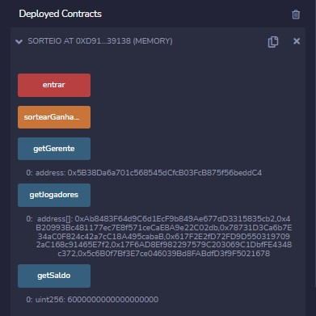

<h1 align="center">   </h1>

## Descrição

Projeto introdutório à linguagem *solidity*, desenvolvido durante as aulas do Curso de Blockchain Advanced, da Faculdade de Informática e Administração Paulista (FIAP).

Tem como objetivo desenvolver um **smart contract** na blockchain Ethereum, que realiza um sorteio entre os partipantes da seguinte forma:

1. O responsável pelo contrato (gerente) faz o deploy do contrato na blockchain Ethereum, utilizando a sua carteira digital.
2. Após realizado o deploy, os interessados em participar podem acessar o smart contract, e transferir a quantia definida no contrato, nesse caso de 1 ether, e concorrer ao "bolão".
3. Definida a quantidade de participantes, o gerente, e somente ele pode sortear o ganhador, e o smart contract automaticamente cumpre o estipulado, que é transfeir o saldo do contrato à carteira digital do ganhador.

## Como implementá-lo:

1. O projeto pode ser testado em um ambiente totalmente web-based chamado Remix, disponibilizado pelo projeto Ethereum, através do site https://remix.ethereum.org/.
2. Selecione File Explorers, e em seguida clique no sinal "+" e adicione um novo workspace.
3. Uma vez criado o workspace, logo abaixo do nome escolhido, selecione o botão Create New File, escolha um nome, e salve com a extensão .sol.
4. Copie o código do smartContract_Sorteio.sol e cole no Remix.
5. Novamente na aba esquerda, selecione Solidity Compiler, e no menu dropdown Copiler, escolha a versao compativel com o código, no caso a 0.4.24+commit.e67f0147 e em seguida clique em Compile "nome do arquivo.sol".
   
6. Logo abaixo do Solidity Compiler, na aba esquerda, selecione o Deploy and Run transactions.
7. O Remix, através do enviroment JavaScript VM te fornece 15 carteiras, com 100 ether cada, para realização de testes.
8. Selecione uma, e clique em Deploy. (Essa passa ser a carteira "gerente" do contrato).
9.  Para a realização do teste, com 5 carteiras diferentes, defina o Value para 1 Ehter e clique no botão entrar, que fica logo abaixo, onde são listados os Deployed Contracts.
10. Ainda existe as opções de verificar quem é o gerente, bem como a quantidade de jogadores e o endereço de suas carteiras, e qual o saldo do contrato até o momento.
    <h2 align="center">
11. Após entrar no sorteio com 5 carteiras diferentes, selecione novamente a carteira gerente e selecione sortearGanhador.
     <h2 align="center">

* Observações: O valor de entrada no contrato deve ser o mesmo informado no código (1 ether), caso contrário um erro ocorrerá. O mesmo acontece se um jogador, que não é o gerente, tentar sortear o ganhador.

